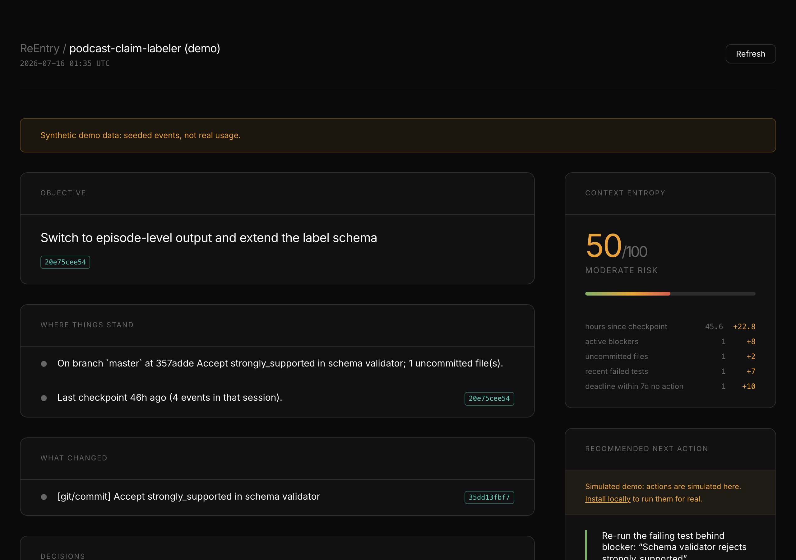
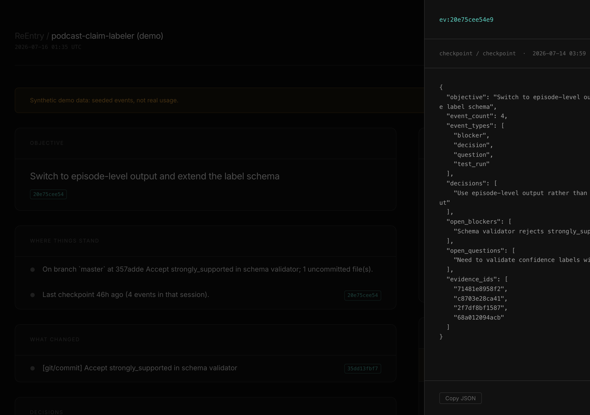
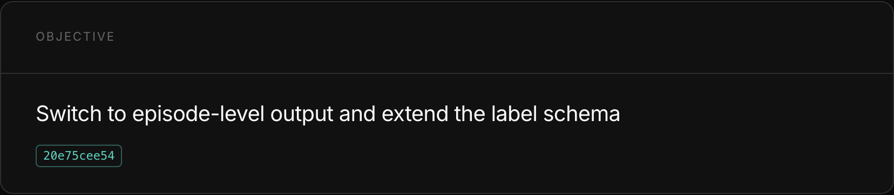
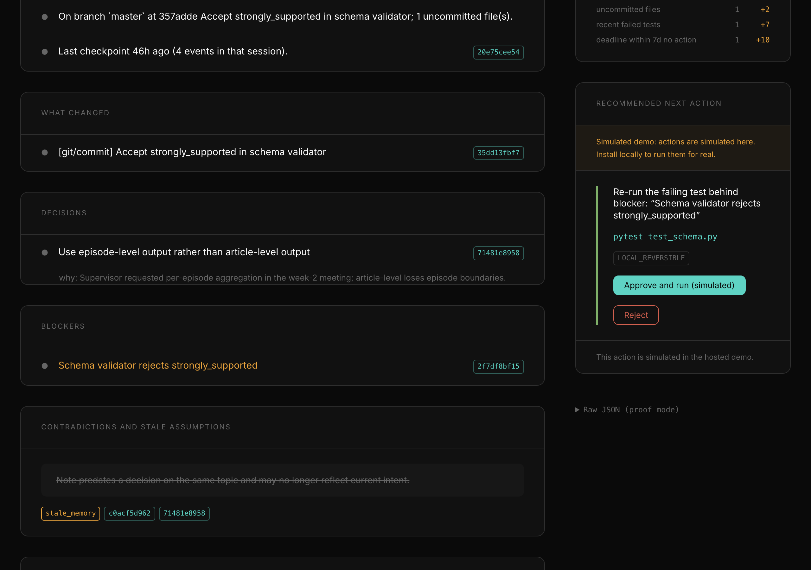

# ReEntry

**Live demo:** [web-ten-theta-37.vercel.app](https://web-ten-theta-37.vercel.app)

[](https://github.com/DevansuA/reentry/actions/workflows/ci.yml)

You open a project you haven't touched in a week. Your notes say one thing, your last commit says another, and the test that was failing might already be fixed. Figuring out where you left off takes longer than the work itself.

ReEntry solves that. It maintains an append-only event ledger from your commits, terminal commands, notes, and decisions, then generates a Re-entry Capsule that tells you what was happening, what changed while you were away, and what to do first. Every sentence in the capsule links to the ledger event that supports it.

## What it looks like

```
$ reentry demo && reentry resume

╭─────────────────────── RE-ENTRY CAPSULE ───────────────────────╮
│ podcast-claim-labeler (demo)   context entropy: 50/100 (moderate) │
╰──────────────────────── 2026-07-15T14:42:32+00:00 ─────────────╯

1. Last known objective
   ● Switch to episode-level output and extend the label schema ‹ev:5b08…›

2. Where things stand
   ● On branch `master` at 0e58862 Accept strongly_supported in schema
     validator; 1 uncommitted file(s).
   ● Last checkpoint 46h ago (4 events in that session). ‹ev:5b08…›

3. What changed
   ● [git/commit] Accept strongly_supported in schema validator ‹ev:fee6…›

4. Decisions
   ● Use episode-level output rather than article-level output ‹ev:8c63…›
     why: Supervisor requested per-episode aggregation in the week-2 meeting.

5. Blockers
   ● Schema validator rejects strongly_supported ‹ev:5dfa…›

6. Contradictions and stale assumptions
   ● Note predates a decision on the same topic and may no longer reflect
     current intent.  classification: stale_memory  ‹ev:f401…,8c63…›

7. Deadlines and commitments
   ● Supervisor review of labelling pipeline   due 2026-07-18 ‹ev:0371…›

8. Recommended next action
   → Re-run the failing test behind blocker: "Schema validator rejects
     strongly_supported"
     pytest test_schema.py  ·  risk: LOCAL_REVERSIBLE
     approve with: reentry approve eaa35a0dd482
```

The stale note, the contradicting decision, the active blocker, and the appropriate next action were all found deterministically from the ledger. No LLM was involved in producing this output.



*Capsule view in the web UI. Evidence chips (cyan) open the raw ledger event behind each claim.*

## Measured results

| System | Checks passed | Applicable |
|---|---|---|
| ReEntry | **20** | **20** |
| Recency baseline (scroll back through recent events) | 4 | 16 |
| Flat-notes baseline (read everything, no reconciliation) | 4 | 16 |

`make eval` regenerates these numbers from scratch and exits 1 on regression. Synthetic scenarios, deterministic graders, no LLM in any evaluation arm. The benchmark isolates the contribution of the temporal state model, not model quality. Full methodology: `docs/EVALUATION.md`.

## Quick start

```bash
pip install -e .           # Python 3.10+; deps: click, rich
reentry demo               # seeded project with 4 planted traps
```

The demo produces the capsule above and seeds a real git repo you can poke at:

```bash
reentry actions            # see the proposed action
reentry approve <id>       # approve, run, verify; blocker is resolved
reentry resume             # regenerate; entropy drops, new action proposed
reentry replay             # chronological event timeline
reentry dashboard          # write a self-contained HTML file (no CDN)
reentry evidence <id>      # raw ledger event behind any ‹ev:…› chip
```

### Web UI

```bash
pip install -e . fastapi uvicorn    # server deps
npm --prefix web install            # once
make demo-full                      # seeds demo, starts servers, opens browser
```

The web app runs on `http://localhost:3000` and the API on `http://localhost:8000`. Evidence chips in the web UI open the same raw ledger JSON as `reentry evidence`. Approve and Reject buttons go through the same validation path as the CLI.



*Clicking an evidence chip opens the raw ledger event JSON proving every claim.*



*Entropy gauge with per-factor breakdown. Each row names a concrete cause and the command to reduce it.*



*The pending action panel. Approve and run sends the exact same request as `reentry approve <id>`.*

### Real project

```bash
cd ~/my-project
reentry init
reentry start -o "finish the results section"
reentry decide "Use episode-level output" -r "supervisor request"
reentry block "schema validator rejects strongly_supported"
reentry checkpoint
# ... days later ...
reentry resume
```

If you forget to checkpoint, ReEntry infers one after 4 hours of inactivity and labels it **inferred** so you know it was not explicit.

## How it works

```
Sources: git, terminal hook, file watcher, GitHub, user input
  Redaction (secrets stripped before the immutable ledger)
  Event Ledger (append-only, idempotent by source event id)
  Derived Claims (evidence_ids, confidence, freshness, inference type)
  Contradiction Radar (rules R1-R4: supersession, stale notes, resolved
    blockers, deadline drift)
  Context Entropy (7 explainable weighted factors, each with a reduce hint)
  Planner (smallest valuable next action)
  Permission Layer (allow-list + risk class + human approval)
  Execution, Verification, Ledger (closed loop)
  Surfaces: CLI capsule, web app, HTML export, MCP server, JSON proof mode
```

See `ARCHITECTURE.md` for the full design and `docs/THREAT_MODEL.md` for the security model.

## What is and isn't built

**Implemented and tested:**

- Append-only event ledger with SQLite triggers that reject UPDATE/DELETE. Idempotent ingestion by `source_event_id`.
- Secret redaction (`redact.py`) before write, because immutability means a leaked secret could never be scrubbed afterwards.
- Derived state: goals, decisions, blockers, notes, questions, deadlines, and commitments, each with evidence ids, freshness, confidence, and inference type (observed / inferred / user-corrected).
- Contradiction Radar with four deterministic rules (R1 decision supersession, R2 stale note vs later decision, R3 blocker vs later passing test, R4 deadline drift).
- Context entropy score with 7 weighted factors and per-factor reduction hints.
- Safe action loop: proposed, approved, executed, verified, closed. Allow-list of command prefixes checked at proposal time and again at execution time. Shell metacharacters rejected. Execution via `subprocess` with `shell=False`, 120 s timeout, 4 KB output cap.
- Re-entry Capsule with live git re-verification at generation time.
- 16-command CLI.
- Self-contained HTML dashboard (no CDN).
- FastAPI server (`server/`) with 9 endpoints and an approve/reject UI surface.
- Next.js web app (`web/`) with a commercial dark design (near-black ground, phosphor cyan accent, Inter Variable typeface). Works against the local FastAPI server or the hosted Vercel demo. No CDN dependencies at runtime.
- MCP server (`mcp/server.py`) exposing 5 read/propose tools. No approve or execute tool exists on the MCP surface; that step is human-only.
- Terminal hook connector (opt-in zsh/bash) with spool-based ingestion and double-pass redaction.
- Filesystem watcher connector using watchdog (path and timestamp only, never contents).
- GitHub connector: read-only REST polling, idempotent by event id, approved reviews resolve "waiting on review" blockers.
- Calendar connector (ICS): `reentry sync-calendar path-or-url.ics`; idempotent by VEVENT UID; deadline summaries feed rule R4.
- VS Code extension: sidebar capsule panel, status-bar entropy, approve/reject from the editor. Packaged as `vscode-extension/reentry-0.1.0.vsix`.
- 81 tests (53 core/connector + 18 API + 10 MCP).

**Not implemented** (designed, not built): Gmail connector, embeddings layer, per-source retention controls, multi-user support. Each has a design sketch in `docs/CONNECTORS.md` and `ROADMAP.md`. No stub pretends to be live.

## Privacy and security

- Local-first: one SQLite file under `~/.reentry/`, no network calls except the optional LLM provider and GitHub sync (both opt-in).
- Secrets (API keys, bearer tokens, private key blocks) are redacted before ingestion. The ledger is append-only, so there is no safe "scrub later" option.
- Ingested text is data, never instructions: a prompt-injection string in a commit message, terminal command, or GitHub event cannot reach `actions.execute`. Three separate tests (core, terminal, GitHub) prove this.
- Git access uses only an allow-listed subcommand set via `subprocess` with `shell=False`.
- The MCP surface has no approve or execute tool. Approval is human-only.
- Full threat model: `docs/THREAT_MODEL.md`.

## Development

```bash
make setup       # Python deps (also: pip install -e . fastapi uvicorn mcp watchdog icalendar)
make setup-web   # Node deps (npm --prefix web install)
make test        # 53 Python tests (core + connectors)
make test-server # 18 API tests (needs PYTHONPATH=.)
make test-all    # all 81 Python tests
make eval        # benchmark, regenerates docs/EVAL_RESULTS.md
make demo        # fresh seeded CLI demo
make demo-full   # seeds + starts both servers + opens browser
make server      # FastAPI server on :8000
make web-dev     # Next.js dev server on :3000
make lint        # compileall + pyflakes
```

**Python 3.10 or later required.** Node 18 or later for the web app. Only `click` and `rich` are required for the CLI; all other deps (`fastapi`, `uvicorn`, `watchdog`, `mcp`, `icalendar`) are optional and needed only for the features that use them.
